# 행복회로 버킷리스트 — 프로젝트 기획서

| 항목 | 내용 |
|---|---|
| 리포 | data09-23 |
| 제출자 | 이영우 |
| 직무·소속 | 휠로더 시험 담당 (data09-09 와 같은 수강생의 두 번째 과제). 이 과제는 업무 밖 생활·재미 주제입니다 |
| 과정 | 현장 데이터 디지털화 전문가과정 1차수 |
| 작성일 | 2026-09-29 |
| 문서 상태 | 초안 v0.1 — 수강생 기획서 v1.1(1~10장) 요약, 1단계 = 기획서 10장 MVP 를 간결하게 줄인 계산 엔진·화면, 2단계 = 로또 평균 자동 수집·추천·계정 동기화 |

이 문서는 제출자가 패들릿 「프로젝트 접수」에 올린 글(2026-09-29 13:11, 제목 「희망회로 버킷리스트 기획서」)과 첨부한 **「행복회로 버킷리스트 프로그램 기획서 v1.1」**(`docs/source/행복회로_버킷리스트_기획서_v1.1.docx`, 이하 「제출 기획서」)을 과정 기획서 형식(10장)으로 정리한 것입니다.
제출 기획서는 산식·인수 기준(AC01~AC26)까지 갖춘 상세 설계서라, **계산 규칙은 제출 기획서를 그대로 따르고** 이 문서는 무엇을 1단계에 넣고 무엇을 미뤘는지를 적습니다.

## 1. 추진 배경과 현안

- 「복권 당첨을 꿈꾸는 모든 직장인들을 위해」 — 당첨됐다고 가정하고 집·여행·가족 선물·휴식 같은 계획을 **비용과 함께** 적어 보는 버킷리스트 시뮬레이터입니다.
- 핵심 경험은 **항목을 추가하거나 포기할 때 남은 예산과 「몇 달을 살 수 있나」가 즉시 바뀌는 것**입니다(제출 기획서 1장).
- 모든 잔고는 실제 계좌가 아닌 사용자가 입력한 **가상 계획의 계산 결과**입니다. 재무 조언이 아닙니다.

## 2. 목표

### 2.1 최종 목표 (제출 기획서)

| 구분 | 사용자가 확인할 핵심 결과 |
|---|---|
| 일시금 모드 (로또·스피또) | 세후 당첨금, 당첨 후 총잔고, 버킷 합계, 계획 후 잔고, 안전금고 제외 가용잔고 |
| 월 지급 모드 (연금복권) | 선택 월 수입과 지출, 해당 월 잔여금, 누적 잔액, 가용잔고, 지급 잔여기간 |
| 공통 | 버킷 편집과 실시간 재계산, 우선순위, 경고, 포기 비교, 퇴사 가능 기간, 결과 공유 |

사용 흐름: 복권과 등수 선택 → 당첨 건과 수량 추가 → 당첨금과 현재 잔고 설정 → 안전금고 설정 → 버킷 작성 → 예산 또는 월별 현금흐름 확인 → 비용과 일정 조정 → 결과 저장 및 공유.

### 2.2 1단계 목표 (이 리포)

제출 기획서 10장의 **P0(출시 필수·연금 핵심·재미와 보존)** 를 간결하게 줄여, **계산 엔진이 5장 계산 예시와 세금 구간 경계를 정확히 재현**하는 것을 최우선으로 합니다(제출 기획서 10장 「1단계는 계산 엔진과 상품·세율 설정을 구현하고 5장 예시 및 경계 테스트를 통과한다」).

- 설치 없이 도는 정적 웹, 계정 없이 이 브라우저에 저장(제출 기획서 8장 「MVP는 계정 없이 브라우저 로컬 저장」).
- 상품 초기값은 **제출 기획서에 적힌 값만** 쓰고 「기획서 기준 값 · 확인일 2026-09-29」로 표시합니다. 모두 고쳐 쓸 수 있습니다.
- 로또 1~3등 평균값 자동 수집은 **하지 않습니다**(2단계). 1단계는 사용자가 금액을 직접 넣습니다.

## 3. 보유 데이터

| 데이터 | 형태 | 비고 |
|---|---|---|
| 상품·등수별 지급 구조 | 제출 기획서 2장 표 | 로또 4등 5만원·5등 5천원, 연금복권 1등 월 700만원 240개월·2등·보너스 월 100만원 120개월·3~7등 일시금, 스피또500 1~4등, 스피또1000·2000 1등. 출처는 제출 기획서 참고자료 [1]~[9](동행복권 안내), 확인 기준일 2026-09-29 |
| 세율 | 제출 기획서 2장 산식 | 200만원 이하 0, 3억원 이하 22%, 초과분 33%(6,600만원 기본액), 연금 월액 22% |
| 사용자 입력 | 당첨 건·잔고·버킷·고정지출 | 가상 값. 실물 복권 번호·개인정보는 받지 않음 |

로또 회차별 당첨금 원자료는 제출되지 않았고, 1단계는 외부 사이트에서 가져오지 않습니다.

## 4. 해결 방안 개요

```mermaid
flowchart LR
  W[당첨 내역<br/>복권·등수·수량<br/>1건당 세전/세후] --> T[과세 단위별 세후<br/>q × net&#40;G&#41;]
  T --> M{월 지급이 있거나<br/>수령 월이 다른가}
  M -- 아니오 --> LS[일시금 대시보드<br/>C₀+N−버킷 = B, A = B−S]
  M -- 예 --> MS[월별 현금흐름<br/>Rₜ = Iₜ−Fₜ−Qₜ<br/>Bₜ = Bₜ₋₁+Rₜ]
  B[버킷·고정지출·안전금고] --> LS & MS
  LS & MS --> O[경고 4단계 · 포기 비교<br/>퇴사 가능 기간 · 공유 이미지]
```

| 단계 | 내용 |
|---|---|
| 입력 정규화·검증 | 원 단위 정수, `YYYY-MM`, 수량 1~100, 금액 0~1조원, 오류 행은 계산 제외(제출 기획서 7·8장) |
| 과세 | 과세 단위(게임·낱장)마다 세후를 먼저 구하고 수량을 곱함 — `net(q×G)` 가 아니라 `q×net(G)` (2B) |
| 월별 확장 | 일시금은 수령 월 한 번, 연금은 첫 지급 월부터 K개월. 시작 월 전 지급분은 현재 잔고와 중복하지 않음 |
| 누적 계산 | 시작 월부터 600개월, 음수를 0으로 보정하지 않음(4장) |
| 지표 | 경고(현금 부족 → 안전금고 침범 → 월 적자 → 낮은 여유), 첫 부족 월, 연금 종료 월, 퇴사 가능 기간 |

## 5. 주요 기능 — 1단계 / 2단계

| 제출 기획서 기능 | 단계 | 1단계에서 한 것 / 미룬 이유 |
|---|---|---|
| 여러 복권·전체 등수·복수 당첨 (2A·7A) | **1단계** | 행마다 복권·등수·수량·세전/세후·수령 월(연금은 첫 지급 월·지급기간). 수정·복제·삭제(되돌리기)·계산 포함 체크. 「1건당」 표시와 세전×수량·예상 세금·세후 합계 즉시 표시 |
| 세금 구간·연금 월액 (2장) | **1단계** | 산식 그대로(정수 연산). 세후 직접 입력은 재과세 없음. 월 100만원에 비과세 규칙 미적용 |
| 조합 프리셋 (2B) | **1단계** | 연금 1등 1매 + 2등 4매 · 보너스 5매 · 스피또2000 세트 1등(낱장 2매) |
| 중복 입력 구분 (2A) | **1단계** | 회차·복권 별칭·게임 위치가 같은 행은 등수가 달라도 차단(한 게임은 최상위 등수만). 식별 정보 없는 똑같은 행은 경고 후 「별도 복권」이면 허용 |
| 잔고·안전금고 (3장) | **1단계** | 현재 잔고 C₀, 「이 돈은 남겨둘래요」 S. 가용 = 잔고 − S, 안전금고는 지출로 빼지 않음. 초기 사용 가능 현금을 넘는 S 는 거부 |
| 버킷 CRUD·보류·필터 (3장) | **1단계** | 제목·금액(「1억 8천만」 같은 한글 단위 입력)·일시성/반복성·월·카테고리 7종·우선순위 3종·메모. 보류/다시 포함, 삭제 되돌리기, 필터·정렬은 보기만 변경, 카테고리별 합계 |
| 일시금 대시보드 (3장·7장) | **1단계** | 세후 당첨금·당첨 후 잔고·버킷 합계·계획 후 잔고·안전금고·가용잔고 + 예산 막대 + 경고 |
| 월별 현금흐름 (4장) | **1단계** | 월 이동(이전·다음·특정 월·첫 부족 월로), 이번 달 수입·지출·잔여, 누적·안전금고·가용, 당첨 건별 지급 잔여(이번 달 포함/지급 후), 20년 총액은 접힌 참고 정보 |
| 고정지출·기타 수입 (4장) | **1단계** | 제목·월 금액·시작·종료 월(비우면 계속)·「퇴사하면 멈춤」 |
| 미래 현금흐름 그래프·표 (4장) | **1단계(간소화)** | 누적 잔액 선 + 안전금고 기준선 + 연금 종료선 + 첫 부족 점, 같은 내용의 월별 표(24개월 → 전체). **달력 화면·수입/지출 막대는 표로 대신**했습니다 |
| 경고 (6장) | **1단계** | 우선순위 4단계, 제출 기획서 6장 문구 그대로. 색과 글자를 함께 표시 |
| 퇴사 가능 기간 (6장) | **1단계** | 안전금고 유지 개월 수(보조: 현금 기준). 일시금은 floor(가용/월 생활비), 월별은 퇴사 월부터 급여 중단 + 생활비로 복제 계산. 부족이 없으면 「600개월 내 부족 없음」 |
| 이거 포기하면 (6장) | **1단계** | 복제 시나리오로 잔고 증가·첫 부족 월·퇴사 기간 변화 미리보기 → 「보류 적용」 또는 취소. 원본은 적용 전까지 그대로 |
| 저장·백업 (8장) | **1단계** | 여러 시나리오 자동 저장(성공·실패 표시), 새로·복제·삭제, JSON 내보내기·가져오기(schemaVersion 2·필드 검증), 전체 초기화 전 범위 안내 |
| 공유 이미지 (6장) | **1단계** | 공개 항목 선택 → 미리보기 → PNG 내려받기, 「가상 시뮬레이션」 문구 포함, 현재 잔고·메모는 기본 숨김. 인쇄/PDF |
| 로또 1~3등 평균 자동 수집 (2장) | **2단계** | 서버 작업(52회차 산술평균·장애 시 마지막 정상값)이 필요합니다. 1단계는 직접 입력 + 「평균이 아니라 가정값」 안내. 평균 식 `round(ΣP/N)` 은 로직에 준비해 두었습니다 |
| 스피또1000·2000 회차별 전체 등위표 (2A) | **2단계** | 제출 기획서에 1등 금액만 있어, 그 밖의 등수는 「직접 입력(가정 시나리오)」로 둡니다. 임의 등수표를 만들지 않습니다 |
| 랜덤 추천 (6장) | **2단계** | 운영자가 등록한 템플릿 목록이 필요합니다(10장 질문 6) |
| 계정·기기 간 동기화·공유 링크·여러 시나리오 비교 (P1) | **2단계** | DB 스키마(`supabase/schema.sql`)와 로컬 검증 하네스는 준비해 두었습니다 |
| 실제 번호 자동 판정·물가·수익률 (P2) | 이후 | 제출 기획서도 P2 로 둠 |

**1단계에서 줄인 규칙** (간결하게 가기 위한 해석 — 10장에서 확인 요청)

- 일시금 모드와 월별 모드는 제출 기획서대로 **자동 판정**합니다(월 지급이 있거나 수령 월이 다르면 월별). 일시금만 있어도 「월별 현금흐름으로 보기」를 켤 수 있습니다. 모드 전환 때 「별도 시나리오 생성」 대신, 일시금 화면에서는 반복 버킷을 합계에서 빼고 그렇다고 알려 줍니다(버킷은 그대로 보존).
- 버킷 폼의 지출 월은 시나리오 시작 월로 미리 채워 두어, 월별 모드로 바뀌어도 지출 월이 비지 않게 했습니다. 비어 있으면 「입력 확인 필요」로 계산에서 뺍니다.
- 기본 조회 기간은 「전체 종료 월 이후 12개월」에 **가장 늦은 예정 지출 월**도 포함해 넓혔습니다(예약 지출이 조회 밖으로 밀리지 않게). 계산은 늘 600개월입니다.

## 6. 기대 산출물

1. **행복회로 버킷리스트(웹, 1단계)** — https://aebonlee.github.io/data09-23/ (「예시」 단추로 5장 계산 예시 3종을 바로 불러옴)
2. **계산 엔진과 테스트** — `js/logic.js`, `test/logic.test.mjs`: 5장 계산 예시 전부, 세금 경계(200만원·3억원·6,600만원 기본액), AC01~AC11·AC15~AC23 중 계산에 해당하는 것
3. **DB 스크립트** — `supabase/schema.sql`(시나리오·당첨·버킷·고정지출, 본인 행만 RLS, 재실행 안전)과 로컬 검증 하네스(`scripts/sqltest/`)

## 7. 기술 구성

| 과정 도구 | 이 프로젝트에서 쓰는 곳 |
|---|---|
| DAY1 암묵지 자산화·전략기획 | 수강생이 직접 쓴 상세 설계서(산식·인수 기준)를 그대로 구현 기준으로 삼음 |
| DAY2 코랩(Python)·바이브코딩 | 계산 엔진·화면 제작 — 이 프로젝트의 중심 |
| DAY3 멀티모달 비정형 정보화 | 해당 없음 |
| DAY4 RAG | 해당 없음 |
| DAY5 Make 자동화 | (2단계 후보) 로또 회차 결과를 정해진 때 읽어 평균값 스냅샷 갱신 |

- 정적 웹(HTML·CSS·일반 스크립트), `index.html` 을 더블클릭해도 열립니다. 외부 CDN·라이브러리 없음.
- 금액은 원 단위 정수, 세금은 정수 연산으로 반올림(부동소수 오차 없음). 계산 함수는 화면·저장소와 분리된 순수 함수(제출 기획서 9장).
- 저장은 localStorage `data09-23.db` 한 칸(시나리오 목록).

## 8. 개발 단계

### 1단계 — 계산 엔진 + 두 대시보드 (완료, 2026-09-29)

- 계산 엔진(세금·연금 월액·복수 당첨·월별 누적·경고·퇴사·포기 비교·가져오기 검증)과 테스트
- 당첨 내역·잔고·버킷·고정지출 입력, 일시금/월별 대시보드, 미래 현금흐름 그래프·표, 저장·백업·공유 이미지

### 2단계 — 데이터 수집·추천·계정

- [ ] 로또 1~3등 평균 스냅샷: 수집 방식 결정(서버 작업 또는 검수된 관리자 등록), 적용 회차 범위·N·갱신일 표시, 실패 시 마지막 정상값, 사용자 수정값은 덮어쓰지 않음
- [ ] 스피또1000·2000 회차별 등위표 등록(검수된 설정만 기본값)
- [ ] 랜덤 추천(운영자 템플릿, 예산·카테고리 조건, 월별 모드는 지정 월 가용잔고·이후 최저 잔액 기준)
- [ ] 계정·동기화: 이메일 로그인 + `supabase/schema.sql` 연결, 공유 링크와 철회, 시나리오 비교
- [ ] 달력 화면, 수입·지출 막대그래프(선택 표시), 분기·연 단위 반복
- [ ] 성과 측정 이벤트(금액·제목·메모 제외)

## 9. 기대 효과

- **꿈을 숫자로** — 「당첨되면 뭐 하지」를 비용과 순서로 적어 보고, 무엇을 포기하면 몇 달을 더 쉴 수 있는지 바로 확인합니다.
- **연금복권의 착시 방지** — 20년 총액을 지금 쓸 수 있는 돈으로 착각하지 않게, 받는 달에만 잔고에 들어오도록 계산합니다(제출 기획서가 출시 차단 오류로 꼽은 항목).
- **세금 감각** — 과세 단위별로 계산해 「20억 한 장」과 「10억 낱장 두 장」의 세후 차이(13억7,300만 vs 14억600만)를 보여 줍니다.

제출 기획서가 성과 지표(첫 버킷 저장 완료율 등)를 정했지만 목표 수치는 운영 데이터 확보 뒤 정하기로 해 여기에도 수치를 적지 않습니다.

## 10. 확인 필요 사항 (수강생께)

1. **이름** — 게시물 제목은 「희망회로」, 기획서는 「행복회로」입니다. 1단계는 「행복회로 버킷리스트」로 했습니다. 맞나요?
2. **로또 평균값 수집(2단계)** — 동행복권 결과를 자동으로 가져올지(서버 작업), 운영자가 검수해 등록할지 정해 주세요. 1단계는 사용자가 금액을 직접 넣습니다.
3. **스피또1000·2000 하위 등수** — 기획서에 1등 금액만 있어 나머지는 직접 입력으로 두었습니다. 회차별 등위표를 쓰려면 기준 회차를 알려 주세요.
4. **안전금고 한도** — 「초기 사용 가능 현금을 넘겨 설정할 수 없다」를 일시금 모드는 당첨 후 잔고, 월별 모드는 현재 잔고 + 시작 월 당첨 수령액으로 해석했습니다. 연금만 있고 현재 잔고가 0이면 첫 달 수령액까지만 설정됩니다. 이 해석이 맞나요?
5. **모드 전환** — 일시금 ↔ 월별 전환 때 「별도 시나리오 생성」 대신, 일시금 화면은 반복 버킷을 합계에서 빼고 알려 주는 방식으로 줄였습니다. 괜찮은가요? (필요하면 「복제」 단추로 시나리오를 따로 만들 수 있습니다)
6. **랜덤 추천 템플릿** — 추천에 쓸 목록(제목·카테고리·추정 비용 10~30개)을 주시면 2단계에 넣겠습니다.
7. **퇴사 계산의 월 생활비** — 월별 모드에서는 고정지출과 별도로 「퇴사 후 월 생활비」를 퇴사 월부터 더합니다. 고정지출에 이미 생활비가 있으면 0으로 두면 됩니다. 이렇게 둘로 나누는 게 맞나요?
8. **공유** — 1단계는 PNG 이미지와 인쇄/PDF 입니다. 링크 공유가 꼭 필요한가요(계정·서버가 필요해 2단계)?

## 부록. 제출 원문 요약

| 출처 | 게시물 | 내용 |
|---|---|---|
| 패들릿 「프로젝트 접수」 (2026-09-29 13:11) | `docs/source/패들릿_제출_원문.md` | 제목 「희망회로 버킷리스트 기획서」, 본문 「복권 당첨을 꿈꾸는 모든 직장인들을 위해...」, 첨부 기획서 v1.1 |
| 첨부 기획서 v1.1 | `docs/source/행복회로_버킷리스트_기획서_v1.1.docx` | 1 목표·핵심 결정 · 2 복권 선택·세후 예상액(2A 등수·복수 당첨, 2B 합산·지급 종료) · 3 잔고·버킷 · 4 연금 월별 시뮬레이션 · 5 계산 예시(5A 등수 중복) · 6 추천 기능 · 7 화면(7A 합산 내역) · 8 데이터 · 9 구현·인수 기준(AC01~AC23, 9A) · 10 MVP·출처 |
